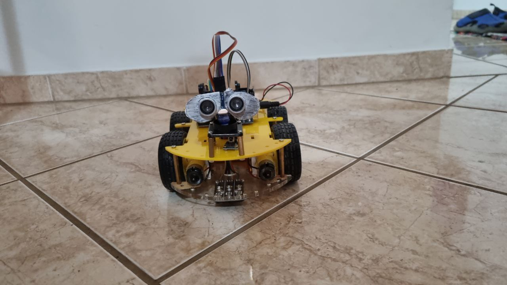
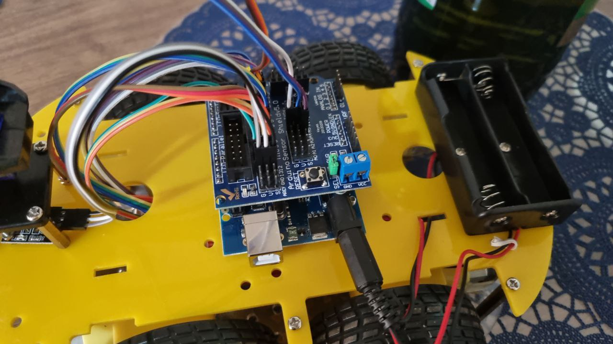
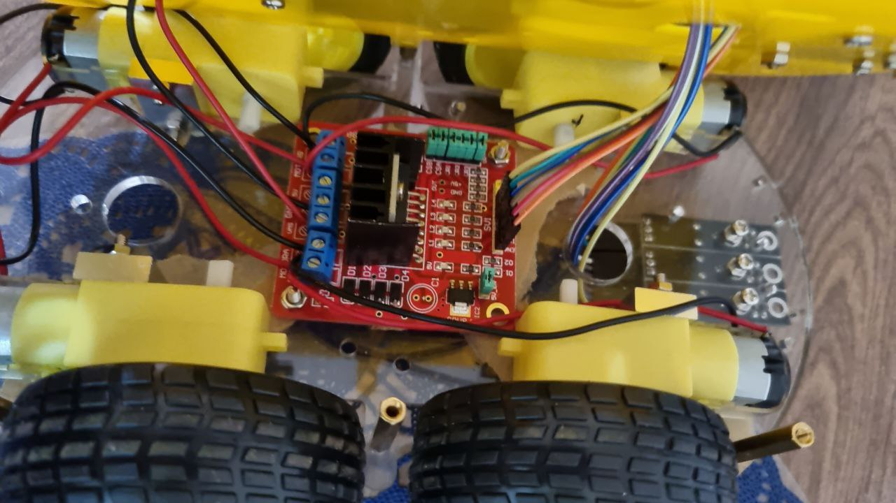
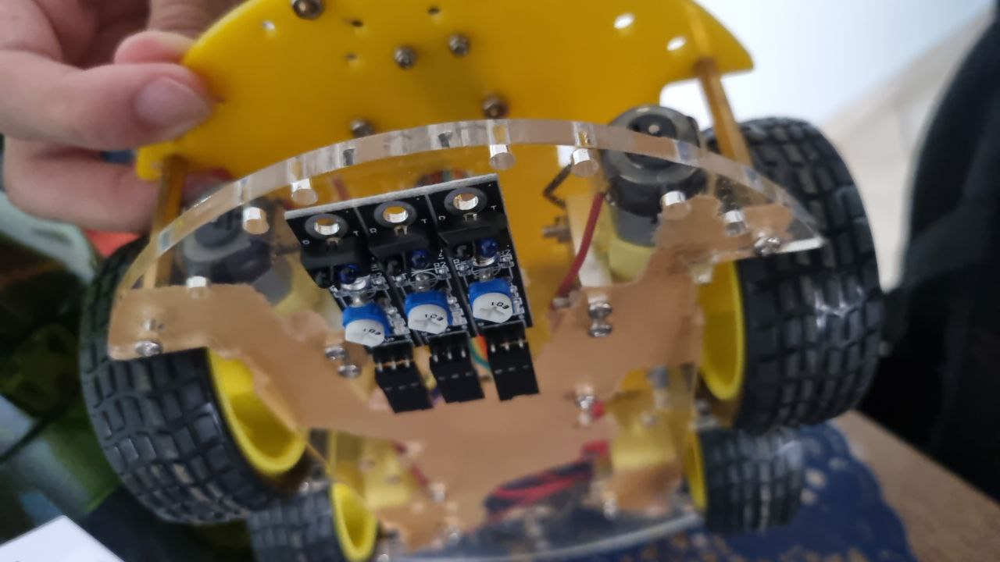
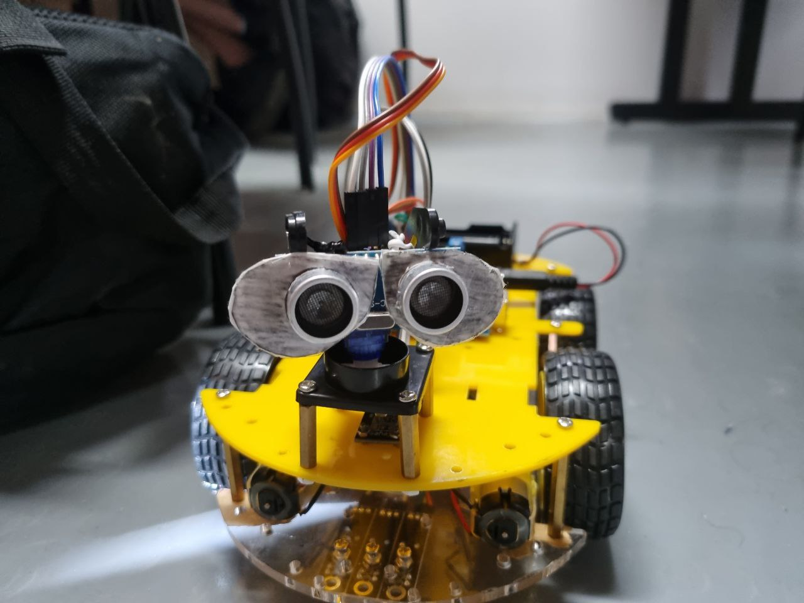
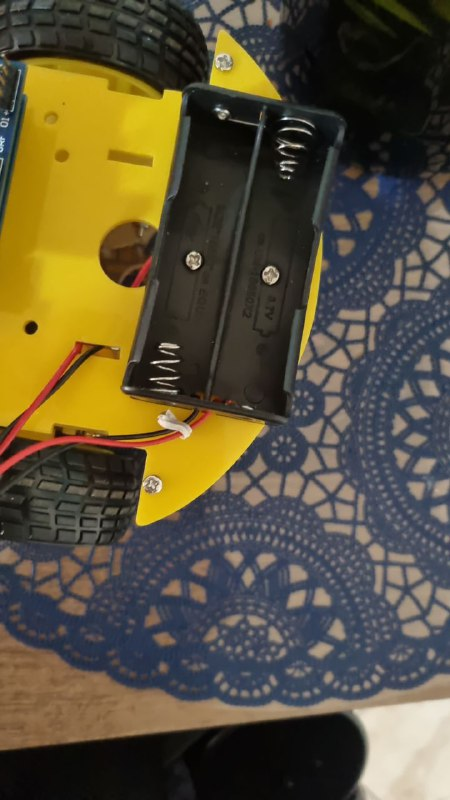
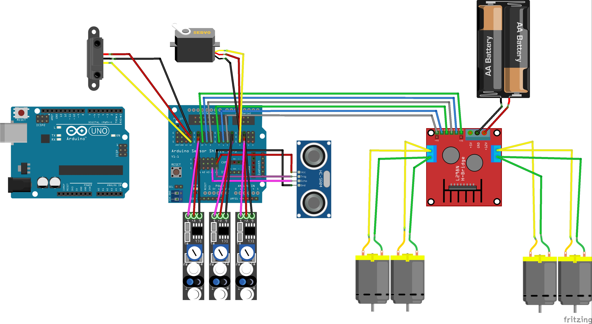
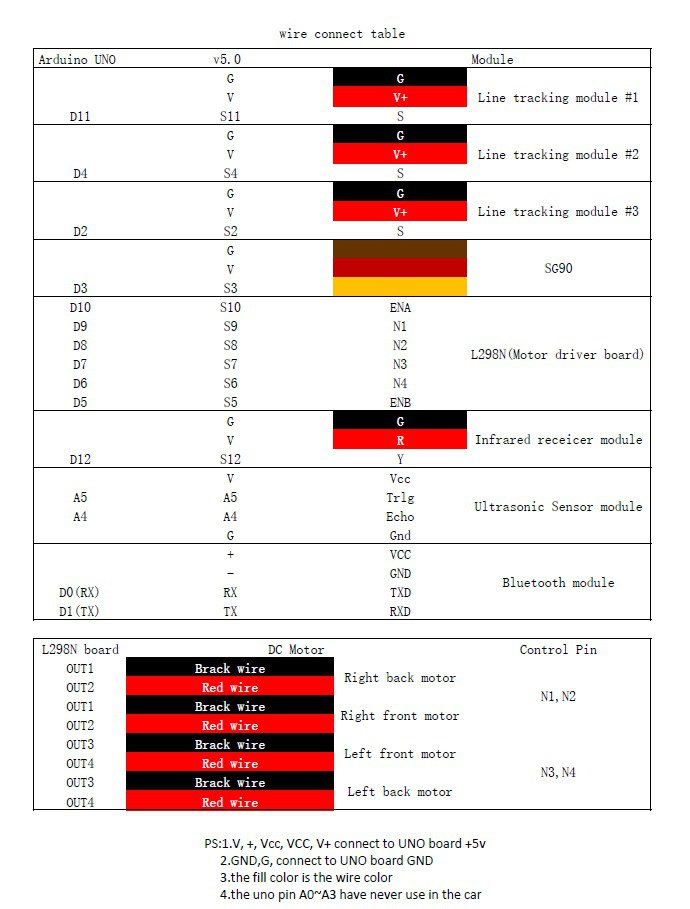

# Projeto2-Arduino, Robô capaz de desviar de obstáculos e de seguir linhas.
Projeto feito para disciplina "Eletrônica para Computação" com o professor Eduardo do Valle Simões

## Lista de componentes:
* **Arduino Uno**;
* **Arduino Shield Sensor v5**;
* **Sensor Ultrassônico**;
* **3x Sensores infravermelhos de segue linha**;
* **Servo Motor**;
* **4x Motores DC**;
* **Ponte H**;
* **2x Pilhas Recarregáveis de 3.7V**.

## Componentes:
<h3>Esse aqui é o Arduino Uno Shield Sensor v5. Usamos ele para conectar no arduino uno e facilitar as conexões dos dados nas entradas e saídas.</h3>
 

<h3>Essa é a ponte H. Por meio dela, conseguimos controlar os dois motores e fazer o carrinho se mover</h3>

<h3>Esses 3 são os sensores infravermelhos de segue linha, eles funcionam com o princípio de que a co preta reflete a luz infravermelha de maneira diferente da branca, assim o carro consegue detectar uma linha preta no chão, por exemplo, e com a programação certa segui-la</h3>

<h3>Esses são os sensores ultrassônicos do robô(com umas folhinhas de papel para parecer o Wall-E). Elas emitem um sinal sonoro e por meio do tempo que esse sinal leva para retornar calculam a distância até um certo objeto. Por meio delas, por exemplo, conseguimos fazer o carro detectar um obstáculo e desviar de direção
</h3>

<h3>Aqui é a fonte de alimentação do nosso projeto, utilizamos duas pilhas de 3.7V para conseguir alimentar o sonar a ponte H o arduino e os sensores infravermelhos.
</h3>

## Diagrama:

## Vídeo de funcionamento:

## Códigos usados estão nos arquivos segue_linha e desvia_de_obstaculos

#### Cógido para seguir linha (arquivo segue_linha)

      //www.elegoo.com
      //2016.09.12
      #include <Servo.h>
      Servo myservo;

      #define LT1 digitalRead(11)
      #define LT2 digitalRead(4)
      #define LT3 digitalRead(2)

      /*define logic control output pin*/
      int in1=9;
      int in2=8;
      int in3=7;
      int in4=6;
      /*define channel enable output pins*/
      int ENA=12;
      int ENB=5;
      /*define forward function*/
      void _mForward()
      { 
        digitalWrite(ENA,10);
        digitalWrite(ENB,10);
        digitalWrite(in1,LOW);//digital output
        digitalWrite(in2,HIGH);
        digitalWrite(in3,HIGH);
        digitalWrite(in4,LOW);
        Serial.println("Forward");
      }
      /*define back function*/
      void _mBack()
      {
        digitalWrite(ENA,10);
        digitalWrite(ENB,10);
        digitalWrite(in1,HIGH);
        digitalWrite(in2,LOW);
        digitalWrite(in3,LOW);
        digitalWrite(in4,HIGH);
        Serial.println("Back");
      }
      /*define left function*/
      void _mleft()
      {
        digitalWrite(ENA,10);
        digitalWrite(ENB,10);
        digitalWrite(in1,LOW);
        digitalWrite(in2,HIGH);
        digitalWrite(in3,LOW);
        digitalWrite(in4,HIGH);
        Serial.println("Left");
      }
      /*define right function*/
      void _mright()
      {
        digitalWrite(ENA,10);
        digitalWrite(ENB,10);
        digitalWrite(in1,HIGH);
        digitalWrite(in2,LOW);
        digitalWrite(in3,HIGH);
        digitalWrite(in4,LOW);
        Serial.println("Right");
      }
      /*put your setup code here, to run once*/
      void setup() {
       Serial.begin(9600); //Open the serial port and set the baud rate to 9600
      /*Set the defined pins to the output*/
        pinMode(in1,OUTPUT);
        pinMode(in2,OUTPUT);
        pinMode(in3,OUTPUT);
        pinMode(in4,OUTPUT);
        pinMode(ENA,OUTPUT);
        pinMode(ENB,OUTPUT);

        myservo.attach(3);  
      }
      /*put your main code here, to run repeatedly*/
      void loop() {
      /*delay(3000);
      _mForward();
      delay(1000);
      _mBack();
      delay(1000);
      _mleft();
      delay(1000);
      _mright();
      delay(1000);*/
        if(LT2){
          myservo.write(90);
          _mForward();
        }
        else if(LT1) { 
          myservo.write(120);
          _mleft();                            
        }   
        else if(LT3) {
          myservo.write(60);
          _mright();
        }
      }
      
#### Código para desviar de obstáculos (arquivo desvia_de_obstaculos)

      //www.elegoo.com
      //2016.09.12
      #include <Servo.h>
      Servo myservo;

      int Echo = A5;  
      int Trig = A4; 
      int in1=9;
      int in2=8;
      int in3=7;
      int in4=6;
      int ENA=12;
      int ENB=5;
      int ABS = 150;
      int rightDistance = 0,leftDistance = 0,middleDistance = 0;
      void _mForward()
      { 
        digitalWrite(ENA,HIGH);
        digitalWrite(ENB,HIGH);
        digitalWrite(in1,LOW);//digital output
        digitalWrite(in2,HIGH);
        digitalWrite(in3,HIGH);
        digitalWrite(in4,LOW);
        Serial.println("Forward");
      }
      /*define back function*/
      void _mBack()
      {
        digitalWrite(ENA,HIGH);
        digitalWrite(ENB,HIGH);
        digitalWrite(in1,HIGH);
        digitalWrite(in2,LOW);
        digitalWrite(in3,LOW);
        digitalWrite(in4,HIGH);
        Serial.println("Back");
      }
      /*define left function*/
      void _mleft()
      {
        digitalWrite(ENA,10);
        digitalWrite(ENB,10);
        digitalWrite(in1,LOW);
        digitalWrite(in2,HIGH);
        digitalWrite(in3,LOW);
        digitalWrite(in4,HIGH);
        Serial.println("Left");
      }
      /*define right function*/
      void _mright()
      {
        digitalWrite(ENA,10);
        digitalWrite(ENB,10);
        digitalWrite(in1,HIGH);
        digitalWrite(in2,LOW);
        digitalWrite(in3,HIGH);
        digitalWrite(in4,LOW);
        Serial.println("Right");
      }
      void _mStop()
      {
        digitalWrite(ENA,LOW);
        digitalWrite(ENB,LOW);
        Serial.println("Stop!");
      }
      int Distance_test()   
      {
        digitalWrite(Trig, LOW);   
        delayMicroseconds(2);
        digitalWrite(Trig, HIGH);  
        delayMicroseconds(10);
        digitalWrite(Trig, LOW);
        delayMicroseconds(2);   
        long duracao = pulseIn(Echo, HIGH, 150000L);  
        int Fdistance= duracao * 0.034 / 2;
        delay(25);       
        return Fdistance;
      }  
      void setup() {
        Serial.begin(9600); //Open the serial port and set the baud rate to 9600
        pinMode(Echo, INPUT);    
        pinMode(Trig, OUTPUT); 
        pinMode(in1,OUTPUT);
        pinMode(in2,OUTPUT);
        pinMode(in3,OUTPUT);
        pinMode(in4,OUTPUT);
        pinMode(ENA,OUTPUT);
        pinMode(ENB,OUTPUT);
        myservo.attach(3);
        _mStop();  
      }
      /*put your main code here, to run repeatedly*/
      void loop() {
          myservo.write(90);//setservo position according to scaled value
          delay(500); 
          middleDistance = Distance_test();
          #ifdef send
          #endif

          if(middleDistance < 60)
          {     
            _mStop();
            delay(500);                         
            myservo.write(20);//10°-180°          
            delay(1000);      
            rightDistance = Distance_test();

            #ifdef send
            #endif

            delay(500);
            myservo.write(90);              
            delay(1000);                                                  
            myservo.write(170);              
            delay(1000); 
            leftDistance = Distance_test();

            #ifdef send
            #endif

            delay(500);
            myservo.write(90);              
            delay(1000);
            if(rightDistance<20 && leftDistance < 20)  
            {
              _mBack();
              delay(1000);
              _mStop();
             }
             else if(leftDistance< 20)
             {
              _mright();
              delay(1000);
              _mStop();
             }
             else if(rightDistance<20)
             {
              _mleft();
              delay(1000);
              _mStop();
             }
             else
             {
              _mBack();
              delay(500);
              _mleft();
              delay(500);
              _mStop();
             }
          }  
          else
          {
            _mForward();                     
          }
      }

## Alunos:

Artur De Vlieger Lima

Calebe Damas Nogueira

Gabriel Souza Santos de Almeida

